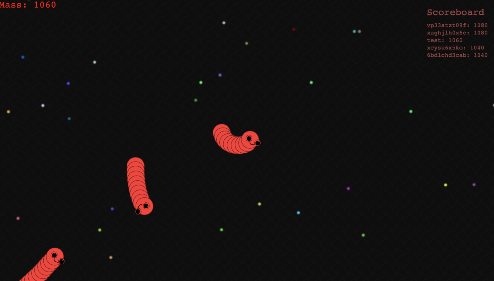

# Snither.io
Remake spinnoff of the popular game Slither.io

# Installation

1. Clone git repository into your favorite code editor

2. Open up a terminal and run "npm install" to install all project dependencies

3. Run index.js file on local machine or on server to start running the game. (Game will be hosted on port 3000)

4. Connect to game through web browser (Example link: http://localhost:3000)

5. Enjoy playing :)

